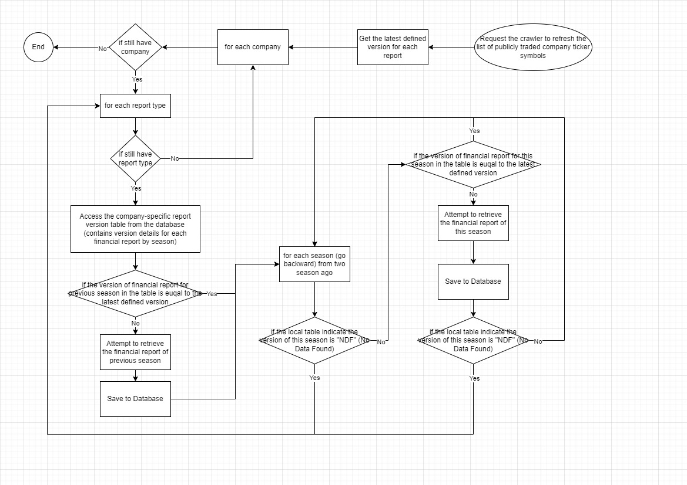

# Crawler Design

## Flowchart

### Modular Design:
* Treat different types of financial reports (e.g., balance sheet, income statement, cash flow statement) as separate modules.
* Implement specific parsing logic for each type of report.

### Dynamic Task Scheduling:
* Use a scheduler like APScheduler to dynamically arrange and adjust scraping tasks.
* Schedule tasks based on the publication cycle of the reports (quarterly, annually, etc.).

### Asynchronous Processing:
* Use asynchronous libraries like asyncio or aiohttp to improve efficiency during I/O operations, especially network requests.

## Data Processing and Storage

### Data Cleaning and Formatting:
* Clean and format the data immediately after scraping.
* Convert data into a uniform format for easy storage and analysis.

### API Integration:
* Send the processed data to the database via an internal API.
* Ensure the API can handle high concurrency and large volumes of data.

## Fault Tolerance and Logging

### Error Handling:
* Implement error handling logic for common issues (e.g., network errors, format changes).
* Retry failed scrapes with a limit on the number of retries.

### Logging:
* Log detailed information about each scrape, including time, status, and error messages.
* Logs are crucial for troubleshooting and optimizing the spider.

## Security and Compliance

### Adherence to Crawling Guidelines:
* Follow the robots.txt rules and scraping policies of the TWSE website.
* Control the scraping rate to avoid overwhelming the site.

### User Agents and IP Rotation:
* Use legitimate user agents.
* If necessary, employ IP rotation techniques to reduce the risk of being blocked.

## Summary
Overall, an effective and stable spider system should comprehensively consider spider strategy, data processing, error handling, logging, security and compliance, architecture design, monitoring, and maintenance and expansion. By adopting a modular design, asynchronous processing, fault tolerance mechanisms, and containerized deployment, you can build a powerful and flexible spider system that not only efficiently completes scraping tasks but is also easy to maintain and expand.
